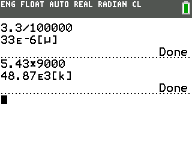

SI Prefix Appender
==================

Because Tim wanted his calculations to have the associated SI prefixes (e.g.
'm' for milli, 'k' for kilo, etc.)

Program and Corresponding Supported Platforms
---------------------------------------------
* `SIHK83P.8XP` TI-83+(SE) / TI-84+(SE)
* `SIHK84PC.8XP` TI-84+CSE
* `SIHK84CE.8XP` TI-84+CE (Premium[?])

Using
-----
**Mathprint**, if your calculator has it, **should be disabled**. The installer 
will turn it off for you on the CE, but it is untested on the 83+/84+CSE.

**Send** the appropriate program **to calculator, then run it** as an Asm( program.
If it doesn't work, try a different program. If none of them runs error-free,
something is wrong that I can't help you with.

**Change to eng mode** to activate the hook features. Do this from the help/mode
menu. See image below. Your mode menu may look something like this.

License
-------
Do whatever.

Credits
-------
* rawrs. because rawrs.
* tims. because cherries and rawrs.
* the not-tims. because peoples
* mateoc, because useful.
* others because forgetfulness

